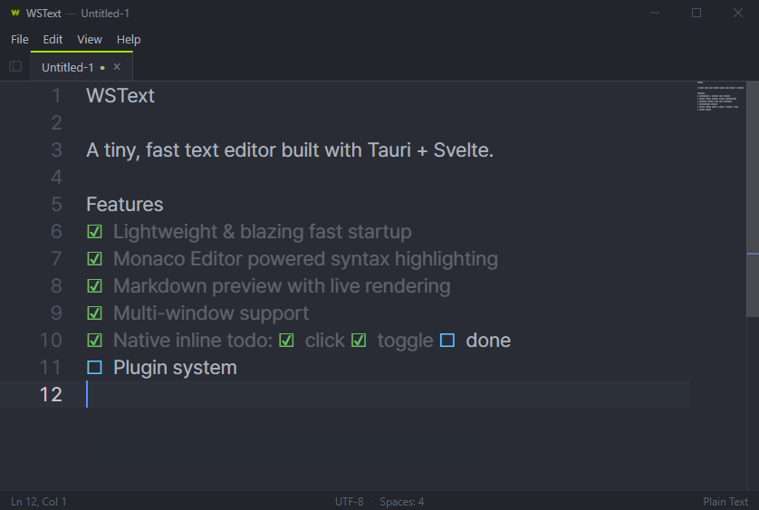

<p align="center">
  
</p>

<h1 align="center">WSText</h1>

<p align="center">
  <strong>A tiny, fast text editor with native todo checkboxes and markdown preview.</strong>
</p>

<p align="center">
  Built with Tauri v2 + Svelte 5 + Monaco Editor.<br/>
  Inspired by Sublime Text — only the essentials, nothing more.
</p>

<p align="center">
  <a href="README.ko.md">한국어</a>
</p>

<p align="center">
  
</p>

---

## Features

**Core**
- Lightweight native desktop app (~10MB installer)
- Multi-tab editing with session restore
- Ctrl+mousewheel zoom, word wrap, minimap
- Drag & drop file open, recent files list
- Auto-detect file encoding (UTF-8, UTF-16 LE/BE, Latin-1)

**Native Todo Checkboxes**
- Type `[]` and it becomes a checkbox `☐`
- Click or `Ctrl+Enter` to toggle checked `☑`
- Checked items turn semi-transparent
- Multi-line select + `Ctrl+Enter` toggles all at once
- Saved as standard `[ ]` / `[x]` in files — compatible everywhere

**Markdown Preview**
- Split view: editor + live preview side by side
- Toggle via status bar button or `Ctrl+Shift+M`
- `.md` files open in split view automatically
- Syntax-highlighted code blocks, tables, task lists

**Customization**
- 5 built-in themes (One Dark, Monokai, Dracula, Solarized Dark/Light)
- System font picker with Korean font support
- Bundled [Pretendard](https://github.com/orioncactus/pretendard) font
- Settings dialog: General / Font / Theme

## Install

Download the latest release from [Releases](../../releases):

| Platform | File | Notes |
|----------|------|-------|
| Windows (installer) | `WSText_x.x.x_x64-setup.exe` | Recommended. Includes auto-update. |
| Windows (portable) | `WSText-portable.exe` | No install needed. Update notifications only. |
| macOS | `WSText_x.x.x_aarch64.dmg` | Apple Silicon. Includes auto-update. **See note below.** |

The app checks for updates on startup and notifies you when a new version is available.

### macOS: "WSText is damaged" message

The macOS build is currently **not signed with an Apple Developer certificate**. When you download and try to open it, macOS may show:

> "WSText" is damaged and can't be opened. You should move it to the Trash.

The app is **not** actually damaged — this is macOS Gatekeeper rejecting unsigned downloads from the internet. Remove the quarantine attribute that macOS attached during download:

1. Open the `.dmg` and drag `WSText.app` into `/Applications`.
2. Open Terminal and run:
   ```bash
   xattr -cr /Applications/WSText.app
   ```
   If that doesn't work:
   ```bash
   sudo xattr -rd com.apple.quarantine /Applications/WSText.app
   ```
3. Launch WSText from Launchpad or the Applications folder.

You only need to do this once per install. Proper code signing + notarization is on the roadmap.

## Keyboard Shortcuts

| Action | Shortcut |
|--------|----------|
| New file | `Ctrl+N` |
| Open file | `Ctrl+O` |
| Save | `Ctrl+S` |
| Save as | `Ctrl+Shift+S` |
| Close tab | `Ctrl+W` |
| Close all tabs | `Ctrl+Shift+W` |
| Toggle checkbox | `Ctrl+Enter` |
| Toggle preview | `Ctrl+Shift+M` |
| Zoom in/out | `Ctrl+Mouse wheel` |
| Next/prev tab | `Ctrl+Tab` / `Ctrl+Shift+Tab` |

## Build from Source

**Prerequisites**: Node.js 20+, Rust, platform build tools ([Tauri prerequisites](https://v2.tauri.app/start/prerequisites/))

```bash
# Install dependencies
npm install

# Dev mode
npm run tauri dev

# Release build
npm run tauri build
```

## Roadmap

- [x] Project mode — manage multiple files and folders
- [ ] macOS code signing & notarization
- [ ] Plugin system
- [ ] Linux support

## Tech Stack

| Layer | Tech |
|-------|------|
| Runtime | [Tauri v2](https://v2.tauri.app) |
| Frontend | [Svelte 5](https://svelte.dev) |
| Editor | [Monaco Editor](https://microsoft.github.io/monaco-editor/) |
| Markdown | [marked](https://marked.js.org) + [highlight.js](https://highlightjs.org) |
| Font | [Pretendard](https://github.com/orioncactus/pretendard) |

## License

This project is licensed under the [GNU Affero General Public License v3.0](LICENSE).
